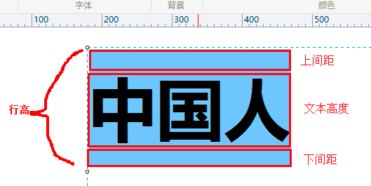
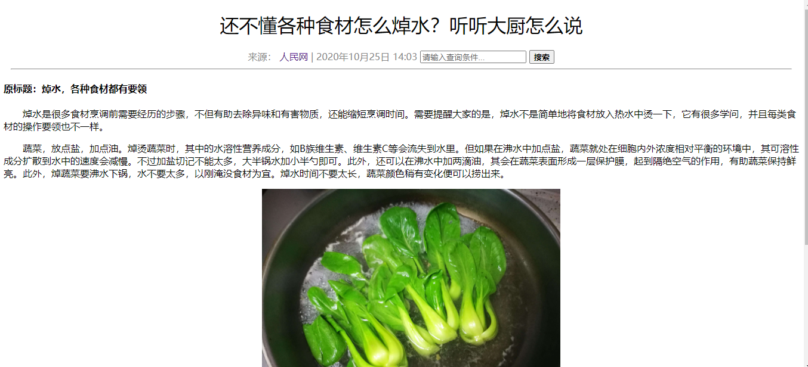

## 01 CSS 简介

CSS 的主要使用场景就是美化网页，布局页面的

### 1.1 HTML 的局限性

HTML **只关注内容的语义**，比如 `<h1>` 表明这个是一个大标题，`<p>` 表明这是一个段落，`` 表明这有个图片，`<a>` 表示此处有链接

早期，世界上网站虽然很多，但都有一个共同的特点 —— 丑

虽然 HTML 可以做简单的样式，但带来的时无尽的臃肿和繁琐


### 1.2 CSS-网页美容师

**CSS**，是**层叠样式表(Cascading Style Sheets)** 的简称

有时我们也会称之为 **CSS样式表** 或 **级联样式表**

CSS 也是一种标记语言

CSS 主要用于设置 HTML 页面中的 **文本内容**（字体、大小、对齐方式等）、**图片的外形**（宽度、高度、边框样式、边距等）以及 **版面的布局和外观显示样式**

CSS 让我们的网页更加丰富多彩，布局更加的灵活自如，简单理解：**CSS可以美化HTML，让HTML更加漂亮，让页面布局更加简单**

```markdown
# 总结
- HTML 主要做结构，显示元素内容
- CSS 美化 HTML，布局网页
- CSS 的最大价值：由HTML专注做结构呈现，样式交给CSS，即结构（HTML）与样式（CSS）分离
```


### 1.3 CSS 语法规范

CSS 规则由两个主要的部分构成，**选择器**以及**一条或多条声明**


- **选择器** 是用于指定的 CSS 样式的 **HTML标签**，花括号内是对该对象设置的具体样式
- 属性和属性值以 `键值对` 的形式出现
- 属性是对指定的对象设置的样式属性，例如字体大小、文本颜色等
- 属性和属性值之间用英文 `:` 分开
- 多个键值对之间用英文的 `;` 进行分隔


###  1.4 CSS 代码风格

以下代码书写风格不是强制规范，而是符合实际开发的书写方式

1、样式格式书写

```html
<style>
    /* 展开格式 */
    p {
        color: tomato;
        font-size: 50px;
    }
    /* 紧凑格式 */
    h3 {color: deeppink; font-size: 20px;}
</style>
```

- 推荐 **展开格式**书写，因为更直观

2、样式大小写

```html
<style>
    /* 样式小写 */
    h3 {
        color: deeppink; 
        font-size: 20px;
    }
    /* 样式大写 */
    H3 {
        COLOR: PINK;
    }
</style>
```

- 推荐样式选择器、属性名、属性值关键字全部使用 **小写字母**，特殊情况除外

3、空格规范

```html
<style>
    h3 {
        color: deeppink; 
        font-size: 20px;
    }
</style>
```

- 属性值前面，冒号后面，保留一个空格
- 选择器（标签）和大括号中间保留空格


## 02 CSS 基础选择器

### 2.1 选择器的作用

选择器就是根据不同需求把不同的标签选出来，这就是选择器的作用。就是 **选择标签用的**


### 2.2 选择器分类

选择器分为 **基础选择器** 和 **复合选择器** 两大类，这里我们讲解一下基础选择器

- 基础选择器是由单个选择器组成的
- 基础选择器又包括：**标签选择器**、**类选择器**、**id选择器**、**通配符选择器**


### 2.3 标签选择器

**标签选择器**（元素选择器），是指用 HTML 标签名称作为选择器，按标签名称分类，为某一类标签指定统一的 CSS 样式

**语法：**

```html
<style>
    标签名 {
        属性1: 属性值1;
        属性2: 属性值2;
        属性3: 属性值3;
        ...
    }
</style>
```

**作用：**

标签选择器可以把某一类标签全部选择出来，比如所有的 `div` 标签和所有的 `<p>`  标签

**优点**

能快速为页面中同类型的标签统一设置格式


### 2.4 类选择器

如果想要差异化选择不同的标签，单独选择一个或者某几个标签，可以使用 **类选择器**

**语法：**

```html
<style>
    .类名 {
        属性1: 属性值1;
        ...
    }
</style>
```

例如：将所有拥有 red 类的 HTML 元素均修改为红色

```html
<head>
    <meta charset="UTF-8">
    <meta name="viewport" content="width=device-width, initial-scale=1.0">
    <title>类选择器</title>
    <style>
        .red {
            color: red;
        }
    </style>
</head>
<body>
    <!-- 需要用 class 属性 来调用，class 类的意思 -->
    <div class="red">
        内容
    </div>
</body>
```

类选择器口诀：样式点定义，结构类（class）调用，一个或多个，开发最常用😅

```markdown
# 注意
- 类选择器使用 `.`(英文点号进行标识)，后面紧跟类名(自定义，我们自己命名的)
- 可以理解为给这个标签起名字
- 长名称或词组可以使用中横线为选择器命名 `rich-brian-really-really`
- 不要使用纯数字、中文等命名，尽量使用英文来表示
- 命名规范：Web 前端开发手册
```


### 2.4* 案例:类选择器画盒子


```html
<!DOCTYPE html>
<html lang="en">
<head>
    <meta charset="UTF-8">
    <meta name="viewport" content="width=device-width, initial-scale=1.0">
    <title>选择器案例</title>
    <style>
        .red {
            width: 100px;
            height: 100px;
            /* 背景颜色 */
            background-color: red;
        }
        .green {
            width: 100px;
            height: 100px;
            background-color: green;
        }
    </style>
</head>
<body>
    <div class="red"></div>
    <div class="green"></div>
    <div class="red"></div>
</body>
</html>
```

### 2.4 类选择器-多类名

我们可以给一个标签指定 **多个类名**，从而达到更多的选择目的。这些类名都可以选出这个标签

简单理解就是一个标签有多个名字


#### 2.4.1 多类名使用方式

```html
<div class="red font20"></div>
```

1、在标签 class 属性中写多个类名

2、多个类名中间必须用空格分开


#### 2.4.2 多类名开发中使用场景

1、可以把一些标签元素相同的样式（共同的部分）放到一个类里面

2、这些标签都可以调用这个公共的类，然后再调用自己独有的类


### 2.5 id 选择器

id 选择器可以为标有特定的 id 的 HTML 元素指定特定的样式

HTML 元素以 **id 属性** 来设置 id 选择器，CSS 中 id 选择器以 `#` 来定义

**语法：**

```html
<style>
    #id名 {
		属性1: 属性值1;
        ...
    }
</style>
```

**注意：**id属性只能在每个 HTML 文档中出现一次

**id 选择器和类选择器的区别**

1、类选择器（class）就好比人的名字，一个人有读个名字，同时一个名字可以被多个人使用

2、id 选择器好比人的身份证号码，是唯一的，不得重复

3、id 选择器和类选择器最大的不同在于使用次数上

4、类选择器再修改样式中用的最多，id 选择器一般用于页面唯一性的元素上，经常和 JavaScript 搭配使用


### 2.6 通配符选择器

在 CSS 中，通配符选择器使用 `*` 定义，它表示选取页面中的所有元素（标签）

**语法：**

```html
<style>
    * {
        background-color: rosybrown;
    }
</style>
```

- 通配符选择器不需要调用，自动给所有的元素使用样式
- 特殊情况下才会使用


### 2.7 选择器总结

| 基础选择器   | 作用                               | 特点                                | 使用情况     | 用法               |
| ------------ | ---------------------------------- | ----------------------------------- | ------------ | ------------------ |
| 标签选择器   | 可以选出所有相同的标签，比如 `<p>` | 不能差异化选择                      | 较多         | p {color: red;}    |
| 类选择器     | 可以选出1个或者多个标签            | 可以根据需求选择                    | 非常多       | .nav {color: red;} |
| id 选择器    | 一次只能选择1个标签                | ID 属性只能在每个HTML文档中出现一次 | 一般和js搭配 | #nav {color: red;} |
| 通配符选择器 | 选择所有的标签                     | 选择的太多，有部分不需要            | 特殊情况使用 | * {color: red;}    |

- 每个基础选择器都有使用场景，都需要掌握
- 如果是修改样式，类选择器是使用最多的


## 03 CSS 字体属性

CSS Fonts（字体）属性用于定义字体、大小、粗细和文字样式（如*斜体*）

### 3.1 字体系列

CSS 使用 `font-family` 属性定义文本的字体系列

```html
<style>
    p {
        font-family: "微软雅黑";
    }
    div {
        font-family: Arial, Helvetica, sans-serif;
    }
</style>
```

- 各种字体之间必须使用英文逗号隔开
- 一般情况下，如果有空格隔开的多个单词组成的字体，加引号

- 尽量使用系统默认自带的字体，保证任何用户在浏览器中都能正确的显示
- 最常见的几个字体：

```css
body {font-family: 'Microsoft YaHei', tahoma, arial, 'Hiragino Sans GB';}
```


### 3.2 字体大小

CSS 使用 `font-size` 属性定义字体的大小

```html
<style>
    p {
        font-size: 50px;
    }
</style>
```

- px（像素）大小是我们网页的最常用单位
- 谷歌浏览器默认文字大小为 16px
- 不同浏览器可能默认显示的字号大小不一致，我们尽量给一个明确的大小，不要默认大小，以保证效果统一
- 可以给 body 指定整个页面的文字大小


### 3.3 字体粗细

CSS 使用 `font-weight`  属性设置文本字体的粗细

```html
<style>
    .bold {
        font-weight: bold;
    }
</style>
```

| 属性值  | 描述                                                         |
| ------- | ------------------------------------------------------------ |
| normal  | 默认值（不加粗的）                                           |
| bold    | 定义粗体（加粗的）                                           |
| 100~900 | 400等同于 normal，而700等同于 bold，注意这个数字后面不跟单位 |

- 学会让加粗标签（比如 `h` 和 `strong` 等）不加粗，或者其他标签加粗
- 实际开发，更喜欢用数字加粗


### 3.4 文字样式

CSS 使用 `font-style` 属性设置文本的风格

```html
<style>
    p {
        font-style: normal;
    }
</style>
```

| 属性值 | 作用                                                   |
| ------ | ------------------------------------------------------ |
| normal | 默认值，浏览器会显示标准的字体样式 font-style: normal; |
| italic | 浏览器会显示斜体的字体样式                             |

注意：平时我们很少给文字加斜体，然而是要给斜体标签 `em` `i` 改为不倾斜的字体


### 3.5 字体复合属性

字体属性可以把以上文字样式综合来写，这样可以更节约代码

```html
<style>
    /* 符合属性（简写形式） */
    p {
        font: font-style font-weight font-size/line-height font-family;
    }
</style>
```

- 使用 font 属性时，必须按照上面语法格式中的顺序写，**不能更换顺序**，并且各个属性之间用**空格**隔开
- 不需要设置的属性可以省略（取默认值），但 **必须保留 font-size 和 font-family 属性**，否则 font 属性将不起作用


### 3.6 字体属性总结

| 属性        | 表示     | 注意点                                                       |
| ----------- | -------- | ------------------------------------------------------------ |
| font-size   | 字号     | 我们通常用的单位是 px 像素，一定记得跟上单位                 |
| font-family | 字体     | 实际工作中按照团队约定来写字体                               |
| font-weight | 字体粗细 | 记住加粗是700 或 bold，不加粗是normal 或者400，记住不跟单位  |
| font-style  | 字体样式 | 记住倾斜是 italic，不倾斜是 normal，工作中常用 normal        |
| font        | 字体连写 | 1. 字体连写是有顺序的，不能随意更换位置 2. 其中字号和字体必须同时出现 |


## 04 文本属性

CSS Text（文本）属性可以定义文本的 **外观**，比如文本的颜色、对齐文本、装饰文本、文本缩进、行间距等


### 4.1 文本的颜色

`color` 属性用于定义文本的颜色

```html
<style>
    div {
        color: blue;
    }
</style>
```

| 颜色表示       | 属性值                           |
| -------------- | -------------------------------- |
| 预定义的颜色值 | red，green，blue 等              |
| 十六进制       | 如：#FF0000 #FFC0CB #AFEEEE .... |
| RFB代码        | 如：rgb(245,255,250)             |

- 实开发中十六进制最常用


### 4.2 对齐文本

`text-align` 属性用于设置元素内文本内容的水平对其方式

```html
<style>
    div {
        text-align: center;
    }
</style>
```

| 属性值 | 解释           |
| ------ | -------------- |
| left   | 左对齐（默认） |
| right  | 右对齐         |
| center | 居中对齐       |


### 4.3 装饰文本

`text-decoration` 属性规定添加到文本的修饰，可以给文本添加下划线、删除线、上划线等

```html
<style>
    div {
        text-decoration: underline;
    }
</style>
```

| 属性值       | 描述                              |
| ------------ | --------------------------------- |
| none         | 默认，没有装饰线（最常用）        |
| underline    | 下划线，链接 a 自带下划线（常用） |
| overline     | 上划线（几乎不用）                |
| line-through | 删除线（不常用）                  |


### 4.4 文本缩进

`text-indent` 属性用来指定文本的第一行进行缩进，通常是将 **段落的首行进行缩进**

```html
<style>
    div {
        text-indent: 10px;
    }
</style>
```

通过设置该属性，所有的元素的第一行都可以缩进一个给定的长度，甚至该长度可以是负值

```html
<style>
    div {
        text-indent: 2em;
    }
</style>
```

`em` 是一个相对单位，就是当前元素（font-size）**1个文字的大小**，如果当前元素没有设置大小，则会按照父元素的1个文字大小


### 4.5 行间距

`line-height` 属性用于设置行间距的距离（行距）。可以控制文字行与行之间的距离

```html
<style>
    p {
        line-height: 26px;
    }
</style>
```



### 4.6 文本属性总结

| 属性            | 表示     | 注意点                                                 |
| --------------- | -------- | ------------------------------------------------------ |
| color           | 文本颜色 | 我们通常使用十六进制，如#FFFFFF 简写 #fff              |
| text-align      | 文本对齐 | 可以设定文字水平对齐方式                               |
| text-indent     | 文本缩进 | 通常我们用于段落首行缩进2个字 的距离 text-indent: 2em; |
| text-decoration | 文本修饰 | 记住 添加下划线 underline 取消下划线 none              |
| line-height     | 行高     | 控制行与行之间的距离                                   |


## 05 CSS 的引入方式

按照 CSS 样式书写的位置（或者引入的方式），CSS样式表可以分为三大类

### 5.1 行内样式表（行内式）

行内样式表（内联样式表）是在 **元素内部标签的 style 属性中设定的 CSS 样式。**适合于简单修改样式

```html
<div style="background-color: deeppink;">夏天夏天悄悄过去留下小秘密</div>
```

- sytle 其实就是标签的属性
- 在双引号中间，写法要符合 CSS 规范
- 可以控制当前的标签设置样式


### 5.2 内部样式表（嵌入式）

内部样式表（内嵌样式表）是写到 HTML 页面内部，是将所有的 CSS 代码抽取出来，单独放到一个 `<style>` 标签中

```html
<head>
    <meta charset="UTF-8">
    <meta name="viewport" content="width=device-width, initial-scale=1.0">
    <title>内部样式表</title>
    <style>
        div {
            background-color: darkviolet;
        }
    </style>
</head>
<body>
    <div>我是文字</div>
    <span>我是蚊子</span>
</body>
```

- `<style>` 标签理论上可以放到 HTML 的任意地方，但一般都会放到 `<head>` 标签中
- 此种方式可以方便控制整个页面中的元素样式设置
- 代码结构清晰，但是没有实现结构与样式的完全分离
- 使用内部样式表设定 CSS，通常也被称为 **嵌入式引入**，这种方式是我们练习时常用的方式


### 5.3 外部样式表（链接式）

实际开发都是外部样式表，适合于样式比较多的情况，核心是：样式单独写到CSS文件中，之后把CSS文件引入到 HTML 页面中使用

引入外部样式表分两步：

1、新建一个后缀名为 .css 的样式文件，把所有的 CSS 代码都放入到其中

2、在 HTML 页面中使用 `<link>` 标签引入这个文件

```html
<link rel="stylesheet" href="style/css01.css">
```


### 5.4 CSS 引入方式总结

| 样式表     | 优点                     | 缺点         | 使用情况 | 控制范围     |
| ---------- | ------------------------ | ------------ | -------- | ------------ |
| 行内样式表 | 书写方便权重高           | 结构样式混写 | 较少     | 控制一个标签 |
| 内部样式表 | 部分结构和样式相分离     | 没有彻底分离 | 较多     | 控制一个页面 |
| 外部样式表 | 完全实现结构和样式相分离 | 需要引入     | 最多     | 控制多个页面 |


## 06 综合案例：新闻页面




## 07 Chrome 调试工具

Chrome 浏览器提供了一个非常好用的调试工具，可以用来调试我们的 HTML 结构和 CSS 样式

1、打开调试工具

打开Chrome 浏览器，按下 `F12键` 或者 点击页面空白处 -> 检查

2、使用调试工具

- `ctrl + 滚轮` 可以 放大/缩小 开发者工具代码的大小
- 左边是 HTML 元素结构，右面是 CSS 样式
- 右边 CSS 样式可以改动数值（左右箭头或者直接输入）和查看颜色
- `ctrl + 0` 复原浏览器大小
- 如果点击元素，发现右侧没有样式引入，极有可能是类名或者样式引入错误
- 如果有样式，但是样式前面有 **黄色叹号提示**，则样式属性书写错误