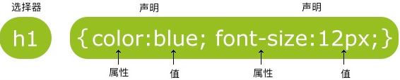
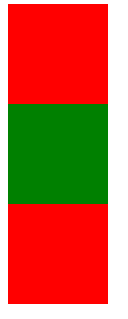

## 01 CSS 简介

CSS 的主要使用场景就是美化网页，布局页面的

### 1.1 HTML 的局限性

HTML **只关注内容的语义**，比如 `<h1>` 表明这个是一个大标题，`<p>` 表明这是一个段落，`` 表明这有个图片，`<a>` 表示此处有链接

早期，世界上网站虽然很多，但都有一个共同的特点 —— 丑

虽然 HTML 可以做简单的样式，但带来的时无尽的臃肿和繁琐


### 1.2 CSS-网页美容师

**CSS**，是**层叠样式表(Cascading Style Sheets)** 的简称

有时我们也会称之为 **CSS样式表** 或 **级联样式表**

CSS 也是一种标记语言

CSS 主要用于设置 HTML 页面中的 **文本内容**（字体、大小、对齐方式等）、**图片的外形**（宽度、高度、边框样式、边距等）以及 **版面的布局和外观显示样式**

CSS 让我们的网页更加丰富多彩，布局更加的灵活自如，简单理解：**CSS可以美化HTML，让HTML更加漂亮，让页面布局更加简单**

```markdown
# 总结
- HTML 主要做结构，显示元素内容
- CSS 美化 HTML，布局网页
- CSS 的最大价值：由HTML专注做结构呈现，样式交给CSS，即结构（HTML）与样式（CSS）分离
```


### 1.3 CSS 语法规范

CSS 规则由两个主要的部分构成，**选择器**以及**一条或多条声明**



- **选择器** 是用于指定的 CSS 样式的 **HTML标签**，花括号内是对该对象设置的具体样式
- 属性和属性值以 `键值对` 的形式出现
- 属性是对指定的对象设置的样式属性，例如字体大小、文本颜色等
- 属性和属性值之间用英文 `:` 分开
- 多个键值对之间用英文的 `;` 进行分隔


###  1.4 CSS 代码风格

以下代码书写风格不是强制规范，而是符合实际开发的书写方式

1、样式格式书写

```html
<style>
    /* 展开格式 */
    p {
        color: tomato;
        font-size: 50px;
    }
    /* 紧凑格式 */
    h3 {color: deeppink; font-size: 20px;}
</style>
```

- 推荐 **展开格式**书写，因为更直观

2、样式大小写

```html
<style>
    /* 样式小写 */
    h3 {
        color: deeppink; 
        font-size: 20px;
    }
    /* 样式大写 */
    H3 {
        COLOR: PINK;
    }
</style>
```

- 推荐样式选择器、属性名、属性值关键字全部使用 **小写字母**，特殊情况除外

3、空格规范

```html
<style>
    h3 {
        color: deeppink; 
        font-size: 20px;
    }
</style>
```

- 属性值前面，冒号后面，保留一个空格
- 选择器（标签）和大括号中间保留空格


## 02 CSS 基础选择器

### 2.1 选择器的作用

选择器就是根据不同需求把不同的标签选出来，这就是选择器的作用。就是 **选择标签用的**


### 2.2 选择器分类

选择器分为 **基础选择器** 和 **复合选择器** 两大类，这里我们讲解一下基础选择器

- 基础选择器是由单个选择器组成的
- 基础选择器又包括：**标签选择器**、**类选择器**、**id选择器**、**通配符选择器**
- 

### 2.3 标签选择器

**标签选择器**（元素选择器），是指用 HTML 标签名称作为选择器，按标签名称分类，为某一类标签指定统一的 CSS 样式

**语法：**

```html
<style>
    标签名 {
        属性1: 属性值1;
        属性2: 属性值2;
        属性3: 属性值3;
        ...
    }
</style>
```

**作用：**

标签选择器可以把某一类标签全部选择出来，比如所有的 `div` 标签和所有的 `<p>`  标签

**优点**

能快速为页面中同类型的标签统一设置格式


### 2.4 类选择器

如果想要差异化选择不同的标签，单独选择一个或者某几个标签，可以使用 **类选择器**

**语法：**

```html
<style>
    .类名 {
        属性1: 属性值1;
        ...
    }
</style>
```

例如：将所有拥有 red 类的 HTML 元素均修改为红色

```html
<head>
    <meta charset="UTF-8">
    <meta name="viewport" content="width=device-width, initial-scale=1.0">
    <title>类选择器</title>
    <style>
        .red {
            color: red;
        }
    </style>
</head>
<body>
    <!-- 需要用 class 属性 来调用，class 类的意思 -->
    <div class="red">
        内容
    </div>
</body>
```

类选择器口诀：样式点定义，结构类（class）调用，一个或多个，开发最常用😅

```markdown
# 注意
- 类选择器使用 `.`(英文点号进行标识)，后面紧跟类名(自定义，我们自己命名的)
- 可以理解为给这个标签起名字
- 长名称或词组可以使用中横线为选择器命名 `rich-brian-really-really`
- 不要使用纯数字、中文等命名，尽量使用英文来表示
- 命名规范：Web 前端开发手册
```

### 2.4* 案例:类选择器画盒子



```html
<!DOCTYPE html>
<html lang="en">
<head>
    <meta charset="UTF-8">
    <meta name="viewport" content="width=device-width, initial-scale=1.0">
    <title>选择器案例</title>
    <style>
        .red {
            width: 100px;
            height: 100px;
            /* 背景颜色 */
            background-color: red;
        }
        .green {
            width: 100px;
            height: 100px;
            background-color: green;
        }
    </style>
</head>
<body>
    <div class="red"></div>
    <div class="green"></div>
    <div class="red"></div>
</body>
</html>
```

### 2.4 类选择器-多类名

我们可以给一个标签指定 **多个类名**，从而达到更多的选择目的。这些类名都可以选出这个标签

简单理解就是一个标签有多个名字


#### 2.4.1 多类名使用方式

```html
<div class="red font20"></div>
```

1、在标签 class 属性中写多个类名

2、多个类名中间必须用空格分开


#### 2.4.2 多类名开发中使用场景

1、可以把一些标签元素相同的样式（共同的部分）放到一个类里面

2、这些标签都可以调用这个公共的类，然后再调用自己独有的类


### 2.5 id 选择器

id 选择器可以为标有特定的 id 的 HTML 元素指定特定的样式

HTML 元素以 **id 属性** 来设置 id 选择器，CSS 中 id 选择器以 `#` 来定义

**语法：**

```html
<style>
    #id名 {
		属性1: 属性值1;
        ...
    }
</style>
```

**注意：**id属性只能在每个 HTML 文档中出现一次

**id 选择器和类选择器的区别**

1、类选择器（class）就好比人的名字，一个人有读个名字，同时一个名字可以被多个人使用

2、id 选择器好比人的身份证号码，是唯一的，不得重复

3、id 选择器和类选择器最大的不同在于使用次数上

4、类选择器再修改样式中用的最多，id 选择器一般用于页面唯一性的元素上，经常和 JavaScript 搭配使用

### 2.6 通配符选择器

在 CSS 中，通配符选择器使用 `*` 定义，它表示选取页面中的所有元素（标签）

**语法：**

```html
<style>
    * {
        background-color: rosybrown;
    }
</style>
```

- 通配符选择器不需要调用，自动给所有的元素使用样式
- 特殊情况下才会使用

### 2.7 选择器总结

| 基础选择器   | 作用                               | 特点                                | 使用情况     | 用法               |
| ------------ | ---------------------------------- | ----------------------------------- | ------------ | ------------------ |
| 标签选择器   | 可以选出所有相同的标签，比如 `<p>` | 不能差异化选择                      | 较多         | p {color: red;}    |
| 类选择器     | 可以选出1个或者多个标签            | 可以根据需求选择                    | 非常多       | .nav {color: red;} |
| id 选择器    | 一次只能选择1个标签                | ID 属性只能在每个HTML文档中出现一次 | 一般和js搭配 | #nav {color: red;} |
| 通配符选择器 | 选择所有的标签                     | 选择的太多，有部分不需要            | 特殊情况使用 | * {color: red;}    |

