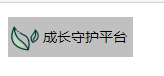

## 01 Emmet 语法

Emment 语法的前身是 `Zen coding`，它使用缩写，来提高 HTML/CSS 的编写速度，Vscode 内部已经集成了该语法

### 1.1 快速生成 HTML 结构语法

1、生成标签，直接输入标签名按 `tab` 键即可，比如 `div` 然后 `tab` 键，就可以生成 `<div></div>`

2、如果想要生成多个相同标签，加上 `*` 就可以，比如 `div*3`，就可以快速生成3个 `<div></div>`

3、如果有父子级关系的标签，可以用 `>`，比如 `ul>li` 即可

4、如果有兄弟关系的标签，用 `+` 就可以了，比如 `div+p`

5、如果生成带有类名或者 id 名字的，直接写 `.class-name` 或者 `#id` 再按 `tab` 键就可以了

6、如果生成的 `div` 类名是有顺序的，可以用自增符号 `$`，比如如 `.demo$*5` 再按 `tab`

7、如果想要再生成的标签内部些内容可以用 `{}` 表示，比如 `div{好的}`


### 1.2 快速生成 CSS 样式语法

CSS 基本采取简写形式即可

1、比如 `w200` 按 `tab` 键就可以生成 `width: 200px`

2、比如 `lh26` 按 `tab` 键就可以生成 `line-height: 26px`


### 1.3 快速代码格式化

Vscode 快速格式化代码：`shift+alt+f`

**也可以设置 当我们保存页面的时候自动格式化代码**

1、文件 -> 首选项 -> 设置

2、搜索 emmet.include

3、再 settings.json 下的 `用户` 中添加以下语句：

```json
"editor.formatOnType": true,
"editor.formatOnSave": true
```

只需要设置一次即可，以后都可以自动保存格式化代码

- 再新版本 Vscode 中直接搜索 format，将保存自动格式化代码选项打勾即可


## 02 CSS 的复合选择器

### 2.1 什么是复合选择器

在 CSS 中，可以根据选择器的类型把选择器分类 **基础选择器** 和 **复合选择器**，复合选择器是建立在基础选择器之上，对基本选择器进行组合形成的

- 复合选择器可以更加准确，更加高效的选择目标元素（标签）
- 复合选择器是 由两个或多个基础选择器，通过不同的方式组合而成的
- 常用的复合选择器包括：后代选择器、子选择器、并集选择器、伪类选择器等等


### 2.2 后代选择器

**后代选择器** 又称 **包含选择器**，可以选择父元素里面的子元素，其写法就是把外城标签写在前面，内层标签写在后面，中间用空格分隔。当标签发生嵌套时，内层标签就成为外层标签的后代

```html
<style>
    元素1 元素2 {
        样式声明;
    }
</style>
```

上述语法表示 **选择元素1里面的元素2**（后代元素）

- 元素1 与 元素2 之间一定用 **空格隔开**
- 元素1 是父级元素，元素2 是子级，最终选择的是 **元素2**
- 元素2 可以是儿子，可以是孙子等，只要是元素1 的后代即可
- 元素1 和 元素2 可以是任意的基础选择器


### 2.3 子选择器

**子元素选择器（子选择器）**只能选择作为某元素的最近一级子元素。简单理解就是选亲儿子元素

语法：

```html
<style>
    元素1>元素2 {
        样式声明;
    }
</style>
```

- 元素1 和 元素2 之间用**大于号** 分隔开
- 元素1 是父级，元素2 是子级，**最终选择的是元素2**
- 元素2 必须是亲儿子，其孙子、重孙子之类都不归他管，你也可以叫他亲儿子选择器


### 2.4 并集选择器

**并集选择器可以选择多组标签，同时为他们定义相同的样式**，通常用于集体声明

并集选择器是各选择器通过**英文逗号 `,` 连接而成**，任何形式的选择器都可以作为并集选择器的一部分

语法：

```html
<style>
    元素1, 元素2 {
        样式声明;
    }
</style>
```

上述语法表示**选择元素1和元素2**

- 元素1 和元素2 之间使用 **逗号隔开**
- 逗号可以理解为和的意思
- 并集选择器通常用于集体声明


### 2.5 伪类选择器

**伪类选择器** 用于向某些选择器添加特殊的效果，比如给链接添加特殊效果，或选择第一个，第n个元素

伪类选择器书写最大的特点就是 **用 `:`  来表示**，比如：`:hover`、`:first-child`

因为伪类选择器有很多，比如有链接伪类，结构伪类等，所以这里先介绍常用的链接伪类选择器


#### 2.5.1 链接伪类选择器

```css
a:link			/* 选择所有未被访问的链接 */
a:visited		/* 选择所有已被访问的链接 */
a:hover			/* 选择鼠标指针位于其上的链接 */
a:active		/* 选择活动链接（鼠标按下未弹起的链接） */
```

**链接伪类的注意事项**

1、为了确保生效，请按照 **LVHA** 的顺序声明：`:link`、`:visited`、`:hover`、`:active`

2、因为 a 链接在浏览器中具有默认样式，所以我们在实际工作中都需要给链接单独指定样式


#### 2.5.2 :focus 伪类选择器

`:focus` 伪类选择器用于选取获取焦点的表单元素

焦点就是光标，一般情况 `<input>` 类表单元素才能获取，因此这个选择器也主要针对于表单元素来说

```html
<style>
    /* 把获得光标的 input 表单元素选取出来 */
    input:focus {
        background-color: pink;
        color: red;
    }
</style>
```


### 2.6 复合选择器总结

| 选择器         | 作用                   | 特征             | 使用情况 | 隔开符号及用法                           |
| -------------- | ---------------------- | ---------------- | -------- | ---------------------------------------- |
| 后代选择器     | 用来选择后代元素       | 可以是子孙后代   | 较多     | 符号是 空格                              |
| 子代选择器     | 用于选择近一级元素     | 只选亲儿子       | 较少     | 符号是 大于                              |
| 并集选择器     | 选择某些相同样式的元素 | 可以用于集体声明 | 较多     | 符号是 逗号                              |
| 链接伪类选择器 | 选择不同状态的链接     | 跟链接相关       | 较多     | 重点记住 a{} 和 a:hover 实际开发中的写法 |
| :focus 选择器  | 选择获得光标的表单     | 跟表单相关       | 较少     | input: focus 记住这个写法                |


## 03 CSS 的元素显示模式

了解元素的显示模式可以更好的让我们布局页面

### 3.1 什么是元素的显示模式

作用：网页的标签非常多，在不同的地方会用到不同类型的标签，了解他们的特点**可以更好的布局我们的网页**

元素的显示模式就是**元素（标签）以什么方式进行显示**，比如 `<div>` 自己占一行 ，比如一行可以放多个 `<span>`

HTML 元素一般分为 **块元素** 和 **行内元素** 两种类型

### 3.2 块元素

常见的块元素有 `<h1>`~`<h6>`、`<p>`、`<div>`、`<ul>`、`<ol>`、`<li>`等，其中 `<div>` 标签是最典型的块级元素

块级元素的 **特点**：

- 比较霸道、独占一行
- 高度、宽度、外边距、内边距都可以控制
- 宽度默认是容器（父级宽度）的 100%
- 是一个容器及盒子，里面可以放行内或者块级元素

**注意**：

- 文字类的元素内不能用块级元素
- `<p>` 标签主要用于存放文字，因此 `<p>` 里面不能放块级元素，特别是不能放 `<div>`
- 同理，`<h1>`~`<h6>` 等都是文字类块级元素，里面也都不能放其他块级元素

### 3.3 行内元素

常见的行内元素有 `<a>`、`<strong>`、`<b>`、`<em>`、`<i>`、`<del>`、`<s>`、`<ins>`、`<u>`、`<spna>` 等，其中 `<span>` 标签是 **最典型的行内元素**。行内元素也称为 **内联元素**

行内元素的 **特点**：

- 相邻的元素在一行上，一行可以显示多个
- 高、宽直接设置是无效的
- 默认宽度就是它本身内容的宽度
- 行内元素只能容纳文本或其他行内元素

**注意：**

- 链接里面不能放链接
- 特殊情况链接 `<a>` 里面可以放块级元素，但是给 `<a>` 转换一下块级模式最安全

### 3.4 行内块元素

在行内元素中有几个特殊的标签：``、`<input>`、`<td>`，它们**同时具有块元素和行内元素的特点**。有资料称它们为 **行内块元素**

行内块元素的特点：

- 和相邻行内元素（行内块）在一行上，但是他们之间会有空白缝隙，一行可以显示多个（行内元素特点）
- 默认宽度就是它本身内容的宽度（行内元素特点）
- 高度、行高、外边距以及内边距都可以控制（块级元素特点）

###  3.5 元素显示模式总结

| 元素模式   | 元素排列               | 设置样式               | 默认宽度         | 包含                     |
| ---------- | ---------------------- | ---------------------- | ---------------- | ------------------------ |
| 块级元素   | 一行只能放一个块级元素 | 可以设置宽度、高度     | 容器的100%       | 容器级可以包含           |
| 行内元素   | 一行可以放多个行内元素 | 不可以直接设置宽度高度 | 它本身的宽度     | 容纳文本或者其他行内元素 |
| 行内块元素 | 一行放多个行内块元素   | 可以设置宽度和高度     | 它本身内容的宽度 |                          |

### 3.6 元素显示模式转换

特殊情况下，我们需要元素模式的转换，简单理解：一个模式的元素需要另外一种模式的特性

比如想要增加链接 `<a>` 的触发范围

- **转换成块级元素**： `display: clock`

- 转换成行内元素： `display: inline`
- **转换为行内块元素**：`display: inline-block`

```html
<head>
    <meta charset="UTF-8">
    <meta name="viewport" content="width=device-width, initial-scale=1.0">
    <title>元素显示模式转换</title>
    <style>
        a {
            width: 150px;
            height: 80px;
            background-color: sandybrown;
            /* 行内元素转换为块级元素 */
            display: block;
        }

        div {
            width: 100px;
            height: 100px;
            background-color: salmon;
            /* 把div块级元素转换成行内元素，宽度高度将无效 */
            display: inline;
        }

        span {
            width: 100px;
            height: 100px;
            background-color: rosybrown;
            /* 转换为行内块元素 */
            display: inline-block;
        }
    </style>
</head>

<body>
    <a href="#">真好</a>
    <a href="#">真好啊</a>

    <div>我是块级元素</div>
    <div>我是块级元素</div>
    <div>我是块级元素</div>

    <span>行内元素转换为行内块元素</span>
    <span>行内元素转换为行内块元素</span>
    <span>行内元素转换为行内块元素</span>
</body>
```

### 3.7 一个小工具的使用 snipaste

snipaste 是一个简单但强大的截图工具，可以让你将截图贴回到屏幕上


常用快捷键

1、F1 可以截图，同时测量大小，设置箭头，书写文字等

2、F3 在桌面置顶显示

3、点击图片，alt 可以取色（按下 shift 可以切换取色模式）

4、按下 esc 取消图片显示


其实 QQ 截图也很强大


## 04 案例：简洁版小米商城侧边栏

### 4.1 小米商城侧边栏的样子：


### 4.2 案例的核心思路分为两步：

1. 把链接 `<a>` 转换为块级元素，这样链接就可以但独占一行，并且有宽度和高度
2. 鼠标经过 `<a>` 给链接设置背景颜色


### 4.3 代码

```html
<!DOCTYPE html>
<html lang="en">

<head>
    <meta charset="UTF-8">
    <meta name="viewport" content="width=device-width, initial-scale=1.0">
    <title>小米商城侧边栏</title>
    <style>
        a {
            width: 230px;
            height: 40px;
            background-color: #41454A;
            text-decoration: none;
            display: block;
            font-size: 14px;
            color: #ffffff;
            text-indent: 2em;
        }

        a:hover {
            background-color: #FF6700;
        }
    </style>
</head>

<body>
    <a href="#">手机 电话卡</a>
    <a href="#">电视 盒子</a>
    <a href="#">笔记本 显示器</a>
    <a href="#">家电 插线板</a>
    <a href="#">家电 插线板</a>
    <a href="#">智能 路由器</a>
    <a href="#">电源 配件</a>
    <a href="#">健康 儿童</a>
    <a href="#">音响 耳机</a>
    <a href="#">生活 箱包</a>
</body>

</html>
```


### 4.4 成果图


### 4.5 技巧：单行文字垂直居中

CSS 中没有给我们提供文字垂直居中的代码，这里我们可以通过一个小技巧来实现

解决方案：**让文字的行高等于盒子的高度** 就可以让文字在当前盒子内垂直居中

```html
<style>
    a {
        width: 230px;
        height: 40px;
        background-color: #41454A;
        text-decoration: none;
        display: block;
        font-size: 14px;
        color: #ffffff;
        text-indent: 2em;
        /* 通过让文字高度等于盒子的高度，让文字在盒子内垂直居中 */
        line-height: 40px;
    }

    a:hover {
        background-color: #FF6700;
    }
</style>
```


### 4.6 单行文字垂直居中的原理


**简单理解**：行高的上空隙和下空隙把文字挤到中间了，如果行高小于盒子的高度，文字会偏上，如果行高大于盒子的高度，则文字偏下


## 05 CSS 的背景

通过 CSS 背景属性，可以给页面元素添加背景样式

背景属性可以设置背景颜色、背景图片、背景平铺、背景图片位置、背景图像固定等


### 5.1 背景颜色

**background-color** 属性定义了元素的背景颜色

```css
background-color: 颜色值
```

一般情况下元素背景颜色默认值是 `transparent`（透明）我们也可以手动指定背景颜色为透明色


### 5.2 背景图片

**background-image** 属性描述了元素的背景图像，实际开发中常见于 logo 或者一些装饰性的小图片或者是超大的背景图片，优点是非常便于控制位置（精灵图也是是一种应用场景）

```css
background-image: none | url(url)
```

| 参数值 | 作用                           |
| ------ | ------------------------------ |
| none   | 无背景图（默认的）             |
| url    | 使用绝对或相对地址指定背景图像 |


### 5.3 背景平铺

如果需要在 HTML 页面上对背景图像进行平铺，可以使用 **background-repeat** 属性

```css
background-repeat: repeat | no-repeat | repeat-x | repeat-y
```

| 参数值    | 作用                                 |
| --------- | ------------------------------------ |
| repeat    | 背景图像在纵向和横向上平铺（默认的） |
| no-repeat | 背景图像不平铺                       |
| repeat-x  | 背景图像沿着x轴（横向）平铺          |
| repeat-y  | 背景图像沿着y轴（纵向）平铺          |

```html
<style>
    div {
        width: 300px;
        height: 300px;
        background-image: url(https://chen-test-01-img.oss-cn-beijing.aliyuncs.com/Blog-data/profile/29.jpg);
        /* 1.默认情况下是平铺的 */
        background-repeat: repeat;
        /* 2.背景图片不平铺 */
        /* background-repeat: no-repeat; */
        /* 3.沿着 x 轴平铺 */
        /* background-repeat: repeat-x; */
        /* 4.沿着 y 轴平铺 */
        /* background-repeat: repeat-y; */
        /* 页面元素既可以添加背景颜色，也可以添加背景图片， */
        /* 只不过背景图片会压住背景颜色 */
        background-color: pink;
    }
</style>
```


### 5.4 背景图像位置

利用 **background-position** 属性可以改变图片在背景中的位置

```css
background-position: x y;
```

参数代表的意思是：x坐标和 y坐标，可以使用**方位名词**或者**精确单位**

| 参数值   | 说明                                                        |
| -------- | ----------------------------------------------------------- |
| length   | 百分数 \| 油浮点数字和单位标识符组成的长度值                |
| position | top \| center \| bottom \| left \| center \| right 方位名词 |

1、参数是方位名词

- 如果指定的两个值都是方位名词，则两个值前后顺序无关，比如 `left top` 和 `top left`是一样是的

- 如果值指定了一个方位名词，另一个值省略，则第二个值默认居中对齐

2、如果是精确单位

- 如果参数值是精确坐标，那么第一个肯定是 x 坐标，第二个一定是 y 坐标

- 若只指定了一个参数，那就是 x 坐标，另一个默认垂直居中（y 默认 center）

3、参数是混合单位

- 如果指定的两个值是精确单位和方位名词混合使用，则第一个值是 x 坐标，第二个值是 y 坐标
- 

#### 5.4.1 背景位置案例一

**代码**

```html
<!DOCTYPE html>
<html lang="en">

<head>
    <meta charset="UTF-8">
    <meta name="viewport" content="width=device-width, initial-scale=1.0">
    <title>背景位置案例</title>
    <style>
        h3 {
            width: 125px;
            height: 40px;
            background-color: silver;
            font-size: 14px;
            /*文字取消加粗*/
            font-weight: 400;
            /*文字垂直居中*/
            line-height: 40px;
            background-image: url(../CSS-02.assets/image-20201108205037972.png);
            background-repeat: no-repeat;
            background-position: left center;
            text-indent: 2.5em;
        }
    </style>
</head>

<body>
    <h3>
        成长守护平台
    </h3>
</body>
</html>
```

**成果图**



#### 5.4.2 背景位置案例二

```html
<style>
    body {
        background-image: url(../CSS-02.assets/image-20201108210010553.png);
        background-repeat: no-repeat;
        background-position: center top;
    }
</style>
```


### 5.5 背景图像固定（背景附着）

**background-attachment** 属性设置背景图像是否固定或者随着页面的其余部分滚动

background-attachment 后期可以制作一些视差滚动的效果

```css
background-attachment: scroll | fixed
```

| 参数   | 作用                     |
| ------ | ------------------------ |
| scroll | 背景图象是随对象内容滚动 |
| fixed  | 背景图像固定             |


### 5.6 背景属性复合写法

为了简化背景属性的代码，我们可以将这些属性合并简写在同一个属性 `background` 中，从而节约代码量，当使用简写属性时，没有特定的书写顺序，一般习惯的约定顺序为：

```css
background: 背景颜色 背景图片地址	背景平铺 背景图像滚动 背景图像位置
```

```css
background: black url(../img/image.png) no-repeat fixed center top;
```


### 5.7 背景色半透明

CSS3 为我们提供了背景颜色半透明的效果

```css
background: rgba(0, 0, 0, 0.3);
```

- 最后一个参数是 alpha 透明度，取值范围在 0~1之间
- 我们习惯把 0.3 的 0 省略掉，写为 `background: rgba(0, 0, 0, .3);`
- 注意：背景半透明是指盒子的背景色半透明，盒子里面的内容不受影响
- CSS3 新增属性，是 IE9+ 版本浏览器才支持的
- 实际开发中不太关注兼容性，放心用即可，Chrome 牛逼！


### 5.8 背景总结

| 属性                 | 作用         | 值                                               |
| -------------------- | ------------ | ------------------------------------------------ |
| background-color     | 背景颜色     | 预定义的颜色值/十六进制/RGB代码                  |
| background-image     | 背景图片     | url(图片路径)                                    |
| background-repeat    | 是否平铺     | repeat/no-repeat/repeat-x/repeat-y               |
| background-position  | 背景位置     | length/position 分别是 x 和 y 坐标               |
| background-attchment | 背景附着     | scroll（背景滚动）/fixed（背景固定）             |
| 背景简写             | 书写更简单   | 背景颜色 背景图片地址 背景平铺 背景滚动 背景位置 |
| 背景色半透明         | 背景色半透明 | background: rgba(0, 0, 0, .6); 后面必须是四个值  |

背景图片：实际开发中常见于 logo 或者一些装饰性的小图片，或者是超大的背景图片，优点是非常便于控制位置（精灵图也是一种运用场景）


## 06 综合案例：五彩导航

练习价值：

1. 链接属于行内元素，但此时需要宽度高度，因此需要模式转换
2. 里面文字需要水平居中和垂直居中，因此需要单行文字垂直居中的代码
3. 链接里面需要设置背景图片，因此需要用到背景图片的相关属性设置
4. 鼠标经过变化背景图片，因此需要用到链接伪类选择器

