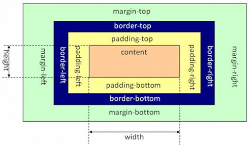
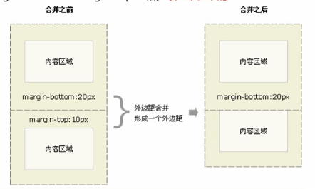
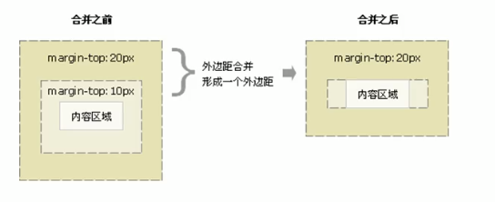
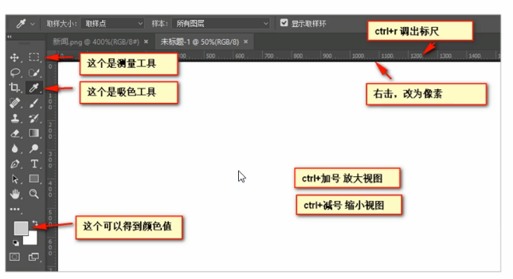
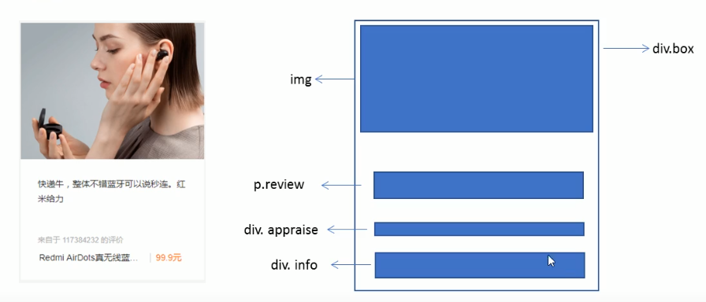

## 01 CSS的三大特性

CSS 有三个非常重要的特性：层叠性，继承性，优先级

### 1.1 层叠性

相同选择器给设置相同的样式，此时一个样式就会 **覆盖（层叠）** 另一个冲突的样式。层叠性主要解决样式冲突的问题

层叠性原则：

- 样式冲突，遵循的原则是 **就近原则**，哪个样式离结构近，就执行哪个样式
- 样式不冲突，不会层叠

### 1.2 继承性

CSS 中的继承，子标签会继承父标签的某些样式，如文本颜色和字号。简单理解：子承父业

+ 恰当的使用继承性可以简化代码，降低 CSS 样式的复杂性
+ 子元素可以继承父元素的样式（text-、font-、line- 这些元素开头的可以继承，以及 color 属性）
+ 继承性口诀：龙生龙 凤生凤 老鼠的儿子会打洞

#### 1.2.1 行高的继承

```css
body {
    font: 12px/1.5 Microsoft YaHei;
}
```

- 行高可一个跟单位也可以不跟单位

- 如果了子元素没有设置行高，则会继承父元素的行高为 1.5
- 此时子元素的行高是：当前子元素文字大小 * 1.5

- body 行高 1.5 这样写的最大优势就是里面子元素可以根据文字大小自动调整行高

### 1.3 优先级

当同一个元素指定多个选择器，就会有优先级的产生

- 选择器相同，则执行层叠性
- 选择器不同，则根据选择器权重执行

选择器的权重如下表所示

| 选择器               | 选择器权重 |
| -------------------- | ---------- |
| 继承 或者 *          | 0，0，0，0 |
| 元素选择器           | 0，0，0，1 |
| 类选择器，伪类选择器 | 0，0，1，0 |
| ID 选择器            | 0，1，0，0 |
| 行内样式 style=""    | 1，0，0，0 |
| !important 重要的    | 无穷大     |

**优先级的注意点：**

1. 权重是有4组数字组成，但是不会有进位
2. 可以理解为类选择器永远大于元素选择器。id 选择器永远大于类选择器，以此类推
3. 等级判断从左向右 ，如果某一位数值相同，则判断下一位数值
4. 可以用简单的记忆方法：通配符和继承权重为 0，标签选择器为 1，类（伪类）选择器为10，id 选择器 100，行内样式表为 1000，!important 无穷大
5. **继承的权重是0** ，如果该元素没有被直接选中，不管父元素权重多高，子元素得到的权重都是0。（所以我们以后看标签到底执行哪个样式，就是先看这个标签没有没被直接选出来）


**权重叠加**：如果是复合选择器，则会由权重叠加，需要计算权重（权重会叠加，但不会进位）

- div ul li -----> 0,0,0,3
- .nav ul li -----> 0,0,1,2
- a:hover -----> 0,0,1,1
- .nav a -----> 0,0,1,1


## 02 CSS盒子模型

页面布局要学习三大核心：盒子模型、浮动、定位。学习好盒子模型能非常好的帮助我们布局页面

### 2.1 看透网页布局的本质

网页布局过程

1. 先准备好相关的网页元素，网页元素基本都是盒子 Box
2. 利用 CSS 设置好盒子样式，然后摆放到相应的位置
3. 往盒子里面装内容

### 2.2 盒子模型(Box Model)组成

所谓 **盒子模型**：就是把 HTML 页面中的布局元素看作是一个矩形的盒子，也就是一个盛装内容的容器。

CSS盒子模型本质上是一个盒子，封装周围的 HTML 元素，它包括：边框、外边距、内边距和实际内容



### 2.3 边框(Border)

`border` 可以设置元素的边框。边框有三部分组成：边框宽度（粗细）、边框样式、边框颜色

语法：

```css
border: border-width || border-style || border-color;
```

| 属性         | 作用                                             |
| ------------ | ------------------------------------------------ |
| border-width | 定义边框的粗细，单位是 px                        |
| border-style | 边框的样式 （solid实线、dashed虚线、dotted点线） |
| border-color | 边框的颜色                                       |

**边框的复合写法**

CSS 边框属性允许指定一个元素边框的 **样式** 和 **颜色**

边框简写：

```css
border: 1px solid red;			/* 没有顺序 */
```

边框分开写法：

```css
border-top: 1px solid red;		/* 只设定上边框，其余同理 */
```


#### 2.3.1 表格的细线边框

`border-collapse` 属性控制浏览器绘制表格边框的方式。它控制相邻单元格的边框

语法：

```css
border-collapse: collapse;
```

- collapse：单元格事合并的意思
- border-collapse： collapse; 表示相邻边框合并在一起


#### 2.3.2 边框会影响盒子的实际大小

边框会额外增加盒子的实际大小，因此我们又两种解决方案

1. 测量盒子大小的时候，不量边框
2. 如果测量的时候包含了边框，则需要 width/height 减去边框宽度


### 2.4 内边距(padding)

`padding` 属性用于设置内边距，即边框与内容之间的距离

| 属性           | 作用     |
| -------------- | -------- |
| padding-left   | 左内边距 |
| padding-right  | 右内边距 |
| padding-top    | 上内边距 |
| padding-bottom | 下内边距 |

`padding` 属性（简写属性）可以有一到四个值

| 值的个数                     | 表达的意思                                                   |
| ---------------------------- | ------------------------------------------------------------ |
| padding: 5px;                | 1个值，代表上下左右都有5像素的内边距                         |
| padding: 5px 10px;           | 2个值，代表上下内边距是5像素，左右内边距是10像素             |
| padding: 5px 10px 20px;      | 3个值，代表上内边距是5像素，左右内边距是10像素，下内边距是20像素 |
| padding: 5px 10px 20px 30px; | 4个值，上是5像素，右10像素，下20像素，左30像素，顺时针       |

当我们给盒子指定 `padding` 后，发生了2件事情

1. 内容和边框有了距离，添加了内边距

2. padding 影响了盒子的实际大小

也就是说，如果盒子已经有了宽度和高度，此时再指定内边距，会撑大盒子

**解决方案：**

如果保证盒子跟效果图大小保持一致，则让 `width/height` 减去多出来的内边距大小即可

```markdown
** 也就是说 盒子加边框 或 内边距 都是往外扩 **
```

### 2.5 案例

#### 2.5.1 新浪导航

**案例：新浪导航案例 - padding 影响盒子的好处**

padding 内边距可以撑开盒子，我们可以做非常巧妙的运用

因为每个导航栏里面的数字不一样多，我们可以不用给内阁盒子宽度了，直接给 padding 最合适

```markdown
- 由于文字长度不同，直接给宽度不合理
- 给 padding 合理

- 相关取值
	1. 上边框为3像素，颜色为 #ff8500
	2. 下边框为1像素，颜色为 #edeef0
	3. 盒子高度为41像素，背景颜色为 #fcfcfc
	4. 文字颜色为 #4c4c4c
```


#### 2.5.2 小米侧边栏修改

**案例：小米导航栏案例修改 padding 影响盒子大小计算**

padding 内边距可以撑开盒子，有时候，也会让我们去修改宽度

所以小米侧边栏这个案例，文字距离左侧的距离不应该用 text-indend 这样不精确

实际开发中的做法是给 padding 这样做会更加精确


#### 2.5.3 padding 不会撑开盒子

**特殊情况**：`padding` 不会撑开盒子

如果盒子本身没有指定 width/height 属性，则此时 padding 不会撑开盒子大小


### 2.6 外边距(margin)

`margin` 属性用于设置外边距，即控制盒子和盒子之间的距离

| 属性          | 作用     |
| ------------- | -------- |
| margin-left   | 左外边距 |
| margin-right  | 右外边距 |
| margin-top    | 上外边距 |
| margin-bottom | 下外边距 |

margin 的简写同 padding

#### 2.6.1 外边距的典型应用

外边距可以让块级盒子水平居中，但是必须满足两个条件：

1. 盒子必须指定的宽度 width
2. 盒子左右的外边距都设置为 auto

```css
.header { width:960px; margin: 0 auto}
```

 常见的写法，以下三种都可以：

- margin-left: auto; margin-right: auto;
- margin: auto;
- margin: 0 auto;

**注意**：以上方法是让块级元素居中，**行内元素或者行内块元素水平居中给父元素天加 text-align: center 即可**

### 2.7 外边距合并

使用 margin 定义块元素的垂直外边距时，可能会出现外边距的合并

#### 2.7.1 相邻块元素垂直外边距的合并

当上下相邻的两个块元素（兄弟关系）相遇时，如果上面的元素有下外边距 `margin-bottom`，下面的元素有上外边距 margin-top，则他们之间的垂直间距不是 `margin-bottom` 与 `margin-top` 之和。取两个值中的较大者这种现象被称为相邻块元素垂直外边距的合并。



**解决方案∶**尽量只给一个盒子添加margin值。


#### **2.7.2 嵌套块元素垂直外边距的塌陷**

对于两个嵌套关系(父子关系)的块元素，父元素有上外边距同时子元素也有上外边距，此时父元素会塌陷较大的外边距值。



**解决方案:**
① 可以为父元素定义上边框。

② 可以为父元素定义上内边距。

③ 可以为父元素添加 `overflow:hidden`。

还有其他方法，比如浮动、固啶定，绝对定位的盒子不会有塌陷问题，后面咱们再总结。

### 2.8 清除内外边距

网页元素很多都带有默认的内外边距，而且不同浏览器默认的也不一致。因此我们在布局前，首先要清除下网页元素的内外边距。

```css
* {
	padding: 0;		/ * 清除内边距*/
    margin : 0;		/ * 清除外边距*/
}
```

**注意∶**行内元素为了照顾兼容性，尽量只设置左右内外边距，不要设置上下内外边距。但是转换为块级和行内块元素就可以了。

## 03 PS基本操作

因为网页美工大部分效果图都是利用PS ( Photoshop )来做的，所以以后我们大部分切图工作都是在PS里面完成。

- `文件` → `打开`∶可以打开我们要测量的图片
- `Ctrl+R`: 可以打开标尺，或者 `视图`→ `标尺` ，右击标尺，把里面的单位改为 `像素` 
- ` Ctrl+加号(+)` 可以放大视图，`Ctrl+减号(-)` 可以缩小视图
- 按住 `空格键`，鼠标可以变成小手，拖动PS视图
- 用 `选区` 拖动可以测量大小
- `Ctrl+D` 可以取消选区，或者在旁边空白处点击一下也可以取消选区




## 04 综合案例

产品模块布局分析



```html
<!DOCTYPE html>
<html lang="zh-CN">

<head>
    <meta charset="UTF-8">
    <meta name="viewport" content="width=device-width, initial-scale=1.0">
    <title>综合案例</title>
    <style>
        * {
            margin: 0;
            padding: 0;
        }

        body {
            background-color: #f5f5f5;
        }

        a {
            color: #333;
            text-decoration: none;
        }

        .box {
            width: 298px;
            height: 415px;
            background-color: #ffffff;
            margin: 100px auto;
        }

        .box img {
            width: 100%;
        }

        .review {
            height: 70px;
            font-size: 14px;
            /*因为这个段落没有 width属性，所以 padding不会撑开盒子的宽度*/
            padding: 0 28px;
            margin-top: 30px;
        }

        .appraise {
            font-size: 12px;
            color: #b0b0b0;
            margin-top: 20px;
            padding: 0 28px;
        }

        .info {
            font-size: 14px;
            margin-top: 15px;
            padding: 0 28px;
        }

        .info h4 {
            display: inline-block;
            font-weight: 400;
        }

        .info span {
            color: #ff6700;
        }

        .info em {
            font-style: normal;
            color: #c2bbb5;
            margin: 0 6px 0 15px;
        }
    </style>
</head>

<body>
    <div class="box">
        
        <p class="review">这是文字这是文字这是文字这是文字这是文字这是文字这是蚊子</p>
        <div class="appraise">
            来自于 123223433 的评价
        </div>
        <div class="info">
            <h4><a href="#">Real life Akkkk是真...</a></h4>
            <em>|</em>
            <span>999元</span>
        </div>
    </div>
</body>

</html>
```


**答疑解惑：**

```markdown
1. 布局为啥用不同盒子,我只想用div ?
标签都是有语义的,合理的地方用合理的标签。比如产品标题就用 h，大量文字段落就用 p。

2. 为啥用辣么多类名?
类名就是给每个盒子起了一个名字,可以更好的找到这个盒子,选取盒子更容易,后期维护也方便。

3. 到底用margin还是padding ?
大部分情况两个可以混用，两者各有优缺点，但是根据实际情况，总是有更简单的方法实现。

4. 自己做没有思路?
布局有很多种实现方式，同学们可以开始先模仿我的写法，然后再做出自己的风格。
最后同学们一定多运用辅助工具,比如屏幕画笔,ps等等
```


