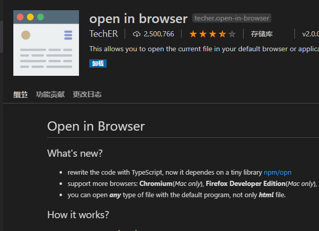
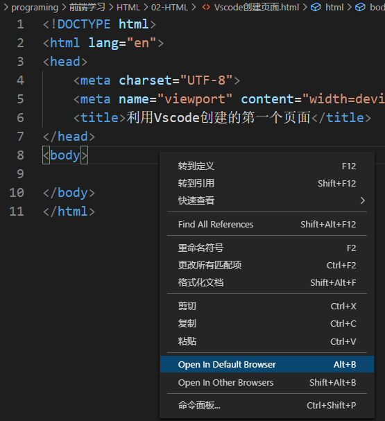
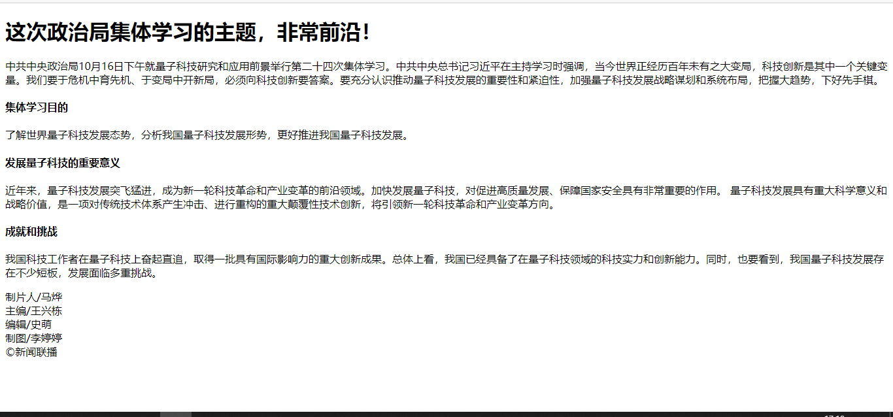

## 01 HTML 语法规范

### 基本语法概述

1、HTML 标签是由**尖括号包围的关键词**，例如 `<html>`

2、HTML 标签通常是**成对出现的**，例如 `<html> </html>`，我们称之为**双标签**，第一个标签是开始标签，第二个标签是结束标签

3、有些特殊的标签必须是单个标签（极少情况），例如 `<br/>`，我们称之为**单标签**


### 标签关系

标签关系可以分为两类：**包含关系** 和 **并列关系**

包含关系：

```html
<head>
    <title></title>
</head>
```

并列关系：

```html
<head></head>
<body></body>
```


## 02 HTML 基本结构标签

### 第一个 HTML 网页

每个网页都会有一个基本的结构标签（也成为骨架标签），页面内容也是在这些基本标签上书写的

HTML 页面也成为 HTML 文档

```html
<html>
    <head>
        <title>标题</title>
    </head>
    <body>
        文档内容
    </body>
</html>
```

| 标签名            | 定义       | 说明                                                 |
| ----------------- | ---------- | ---------------------------------------------------- |
| \<html>\</html>   | HTML标签   | 页面中最大的标签，称为根标签                         |
| \<head>\</head>   | 文档的头部 | 注意是在head标签中我们必须要设置的标签是 head        |
| \<title>\</title> | 文档的标题 | 让页面拥有一个属于自己的网页标题                     |
| \<body>\</body>   | 文档的主体 | 元素包含文档的所有东西，页面内容基本都是放到Body里的 |


## 03 网页开发工具

### 使用 Vscode 创建页面

使用 `!`  `Tab` 快速生成 HTML 模板

插件 `Open in Browser` ，可快速在浏览器中打开





快捷键：

 `ctrl + 加号/减号` 放大/缩小

`Alt + z` 自动换行

推荐安装插件：

| 插件                                                 | 作用                                                       |
| ---------------------------------------------------- | ---------------------------------------------------------- |
| Chinese (Simplified) Language Pack for Visual Studio | 中文（简体）语言包                                         |
| Open in Browser                                      | 右键在浏览器打开 html 文件                                 |
| JS-CSS-HTML Formatter                                | 每次保存，都会自动格式化 .js .css .html 代码（据说不好用） |
| Auto Rename Tag                                      | 自动重命名配对的 HTML/XML 标签                             |
| CSS Peek                                             | 追踪至样式                                                 |


### 使用 Vscode 工具生成骨架标签新增代码

1、\<!DOCTYPE html>

文档类型的 **声明标签**，作用就是告诉浏览器使用哪种 HTML 版本来显示网页

2、\<html lang="en">

用来定义文档的 **显示语言**

```markdown
- en 定义语言为英语
- zh-CN 定义语言为中文
```

3、\<meta charset="UTF-8">

字符集（Character set）是多个字符的集合，以便计算机能够识别和存储各种文字，在 `<head>` 标签的 `charset` 属性来规定 HTML 文档应该使用哪种字符编码

`charset` 常用的值有：GB2312、BIG5、GBK 和 UTF-8，其中 **UTF-8** 也被称为 **万国码** ，基本包含了全世界所有的国家所需要用到的字符


## 04 HTML 常用标签

### 4.1 标题标签 \<h1> - \<h6>

为了使网页更具有语义化，我们经常会在页面中用到标题标签，HTML 提供了6个等级的网页标签 \<h1> - \<h6>

```html
<h1>
    我是一级标签
</h1>
```

单词 head 的缩写，意为头部、标题

**标签语义：** 作为标题使用，并且依据重要性递减


### 4.2 段落和换行标签（⭐）

在网页中，要把文字有条理地显示出来，就要将这些文字分段提示。在 HTML 标签中，`<p>` 标签用于 **定义段落** ，它可以将整个网页分成若干个段落

```html
<p>
    我是一个段落
</p>
```

单词 paragraph 的缩写，意为段落

**标签语义**：可以把 HTML 文档分割为若干段落

```markdown
# 特点
1. 文档在一个段落中会根据浏览器窗口的大小自动换行
2. 段落和段落之间保有空隙
```


在 HTML 中，一个段落标签中的文字会从左到右依次排列，直到浏览器窗口的右端，然后才自动换行，如果希望某段文本强制换行显示，则需要使用 **换行标签** `<br/>`

```html
<br/>
```

单词 break 的缩写，意为 打断、换行

````markdown
# 特点
1. 单标签
2. 只是简单的开始新的一行，跟段落不一样，段落之间会插入一些垂直的间距
````


### 4.3 案例：新闻




### 4.4 文本格式化标签

在网页中，有时需要为文字设置 **粗体**，*斜体* 或 <u>下划线</u> 等效果，这时就需要用到 HTML 中文本格式化标签，使文字以特殊的方式显示

标签语义：突出重要性，比普通文字更重要	

| 语义   | 标签                             | 说明                                      |
| ------ | -------------------------------- | ----------------------------------------- |
| 加粗   | \<strong>\</strong> 或 \<b>\</b> | 推荐使用 \<strong> 标签加粗，语义更加强烈 |
| 倾斜   | \<em>\</em> 或\<i>\</i>          | 推荐使用 \<em> 标签加粗，语义更加强烈     |
| 删除线 | \<del>\</del> 或 \<s>\</s>       | 推荐使用 \<del> 标签加粗，语义更加强烈    |
| 下划线 | \<ins>\</ins> 或 \<u>\</u>       | 推荐使用 \<ins> 标签加粗，语义更加强烈    |


### 4.5 \<div> 和 \<span> 标签

\<div> 和 \<span> 是没有语义的，它们就是一个盒子，用来装内容的

```html
<div>
    这是我
</div>
<span>
	这是span里
</span>
```

div 是 division 的缩写，表示分割，分区。span 意为跨度，跨距

```markdown
# 特点
1. <div> 标签用来布局，但是现在一行只能放一个 div，大盒子
2. <span> 标签用来布局，一行可以放多个 span，小盒子
```


### 4.6 图像标签和路径

#### - 图像标签

在HTMl 中，\ 标签用于定义 HTML 页面中的图像

```html

```

单词 image 的缩写，意为图像

src 是 \ 标签的 **必须属性**，塔用于 **指定图像文件的路径和文件名**

所谓属性，就是属于这个图像标签的特性

图像标签的其他属性

| 属性   | 属性值   | 说明                         |
| ------ | -------- | ---------------------------- |
| src    | 图片路径 | 必须属性                     |
| alt    | 文本     | 替换文本，图像不能显示的文字 |
| title  | 文本     | 提示文本，鼠标放上显示的文字 |
| width  | 像素     | 设置图像的宽度               |
| height | 像素     | 设置图像的高度               |
| border | 像素     | 设置图像的边框粗细           |

```markdown
# 图像标签使用的注意点
1. 图像标签可以拥有多个属性，必须写在标签名的后面
2. 属性值之间不分先后顺序，标签名与属性、属性之间可以使用空格分开
3. 属性采取键值对的格式，即 ‘key'='value' 的格式
```

#### - 路径

```markdown
# 前期铺垫知识
1. 目录文件夹和根目录
	- 在实际工作中，文件不能随意乱放，否则用起来不能快速的找到，因此要建立一个文件夹来管理他们
	- 目录文件夹：就是普通文件夹，只不过里面放了我们做页面所需的相关素材，如html，图片等
	- 根目录：打开目录文件夹的第一层就是根目录
	
2. VSCode 打开目录文件夹
	- 文件=> 打开文件夹，选择目录文件夹，后期非常方便管理文件
```

页面中图片会非常多，通常我们会新建一个文件夹来存放这些文件（image），这时再查找图像，就需要用”路径“的方式来指定图像的文件位置

路径可以分为：

1、相对路径：以 **引用文件所在的位置** 为参考基础，而建立出的目录路径。简单来说就是 **图片相对于 HTML 页面的位置**

相对路径分类：

| 相对路径分类 | 符号 | 说明                                                        |
| ------------ | ---- | ----------------------------------------------------------- |
| 同一级路径   |      | 图像文件位于HTML文件的同一级，如 \       |
| 下一级路径   | /    | 图像文件位于HTML文件的下一级，如 \ |
| 上一级路径   | ../  | 图像文件位于HTML文件的上一级，如 \    |

2、绝对路径：是指目录下的绝对位置，直接到达目标位置，通常是从盘符开始的路径

