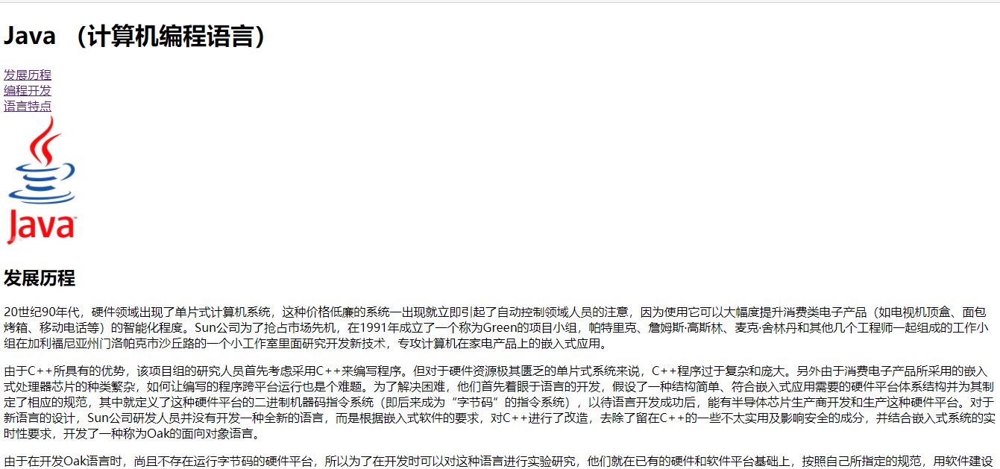

## 01 HTML 语法规范

### 1.1 基本语法概述

1、HTML 标签是由**尖括号包围的关键词**，例如 `<html>`

2、HTML 标签通常是**成对出现的**，例如 `<html> </html>`，我们称之为**双标签**，第一个标签是开始标签，第二个标签是结束标签

3、有些特殊的标签必须是单个标签（极少情况），例如 `<br/>`，我们称之为**单标签**


### 1.2 标签关系

标签关系可以分为两类：**包含关系** 和 **并列关系**

包含关系：

```html
<head>
    <title></title>
</head>
```

并列关系：

```html
<head></head>
<body></body>
```


## 02 HTML 基本结构标签

### 2.1 第一个 HTML 网页

每个网页都会有一个基本的结构标签（也成为骨架标签），页面内容也是在这些基本标签上书写的

HTML 页面也成为 HTML 文档

```html
<html>
    <head>
        <title>标题</title>
    </head>
    <body>
        文档内容
    </body>
</html>
```

| 标签名            | 定义       | 说明                                                 |
| ----------------- | ---------- | ---------------------------------------------------- |
| \<html>\</html>   | HTML标签   | 页面中最大的标签，称为根标签                         |
| \<head>\</head>   | 文档的头部 | 注意是在head标签中我们必须要设置的标签是 head        |
| \<title>\</title> | 文档的标题 | 让页面拥有一个属于自己的网页标题                     |
| \<body>\</body>   | 文档的主体 | 元素包含文档的所有东西，页面内容基本都是放到Body里的 |


## 03 网页开发工具

### 3.1 使用 Vscode 创建页面

使用 `!`  `Tab` 快速生成 HTML 模板

插件 `Open in Browser` ，可快速在浏览器中打开


快捷键：

 `ctrl + 加号/减号` 放大/缩小

`Alt + z` 自动换行

推荐安装插件：

| 插件                                                 | 作用                                                       |
| ---------------------------------------------------- | ---------------------------------------------------------- |
| Chinese (Simplified) Language Pack for Visual Studio | 中文（简体）语言包                                         |
| Open in Browser                                      | 右键在浏览器打开 html 文件                                 |
| JS-CSS-HTML Formatter                                | 每次保存，都会自动格式化 .js .css .html 代码（据说不好用） |
| Auto Rename Tag                                      | 自动重命名配对的 HTML/XML 标签                             |
| CSS Peek                                             | 追踪至样式                                                 |


### 3.2 使用 Vscode 工具生成骨架标签新增代码

1、\<!DOCTYPE html>

文档类型的 **声明标签**，作用就是告诉浏览器使用哪种 HTML 版本来显示网页

2、\<html lang="en">

用来定义文档的 **显示语言**

```markdown
- en 定义语言为英语
- zh-CN 定义语言为中文
```

3、\<meta charset="UTF-8">

字符集（Character set）是多个字符的集合，以便计算机能够识别和存储各种文字，在 `<head>` 标签的 `charset` 属性来规定 HTML 文档应该使用哪种字符编码

`charset` 常用的值有：GB2312、BIG5、GBK 和 UTF-8，其中 **UTF-8** 也被称为 **万国码** ，基本包含了全世界所有的国家所需要用到的字符


## 04 HTML 常用标签

### 4.1 标题标签 \<h1> - \<h6>

为了使网页更具有语义化，我们经常会在页面中用到标题标签，HTML 提供了6个等级的网页标签 \<h1> - \<h6>

```html
<h1>
    我是一级标签
</h1>
```

单词 head 的缩写，意为头部、标题

**标签语义：** 作为标题使用，并且依据重要性递减


### 4.2 段落和换行标签（⭐）

在网页中，要把文字有条理地显示出来，就要将这些文字分段提示。在 HTML 标签中，`<p>` 标签用于 **定义段落** ，它可以将整个网页分成若干个段落

```html
<p>
    我是一个段落
</p>
```

单词 paragraph 的缩写，意为段落

**标签语义**：可以把 HTML 文档分割为若干段落

```markdown
# 特点
1. 文档在一个段落中会根据浏览器窗口的大小自动换行
2. 段落和段落之间保有空隙
```


在 HTML 中，一个段落标签中的文字会从左到右依次排列，直到浏览器窗口的右端，然后才自动换行，如果希望某段文本强制换行显示，则需要使用 **换行标签** `<br/>`

```html
<br/>
```

单词 break 的缩写，意为 打断、换行

````markdown
# 特点
1. 单标签
2. 只是简单的开始新的一行，跟段落不一样，段落之间会插入一些垂直的间距
````


### 4.3 案例：新闻


### 4.4 文本格式化标签

在网页中，有时需要为文字设置 **粗体**，*斜体* 或 <u>下划线</u> 等效果，这时就需要用到 HTML 中文本格式化标签，使文字以特殊的方式显示

标签语义：突出重要性，比普通文字更重要	

| 语义   | 标签                             | 说明                                      |
| ------ | -------------------------------- | ----------------------------------------- |
| 加粗   | \<strong>\</strong> 或 \<b>\</b> | 推荐使用 \<strong> 标签加粗，语义更加强烈 |
| 倾斜   | \<em>\</em> 或\<i>\</i>          | 推荐使用 \<em> 标签加粗，语义更加强烈     |
| 删除线 | \<del>\</del> 或 \<s>\</s>       | 推荐使用 \<del> 标签加粗，语义更加强烈    |
| 下划线 | \<ins>\</ins> 或 \<u>\</u>       | 推荐使用 \<ins> 标签加粗，语义更加强烈    |


### 4.5 \<div> 和 \<span> 标签

`<div>` 和 `<span>` 是没有语义的，它们就是一个盒子，用来装内容的

```html
<div>
    这是我
</div>
<span>
	这是span里
</span>
```

div 是 division 的缩写，表示分割，分区。span 意为跨度，跨距

```markdown
# 特点
1. <div> 标签用来布局，但是现在一行只能放一个 div，大盒子
2. <span> 标签用来布局，一行可以放多个 span，小盒子
```


### 4.6 图像标签和路径

#### - 图像标签

在HTMl 中，` `标签用于定义 HTML 页面中的图像

```html

```

单词 image 的缩写，意为图像

src 是 \ 标签的 **必须属性**，塔用于 **指定图像文件的路径和文件名**

所谓属性，就是属于这个图像标签的特性

图像标签的其他属性

| 属性   | 属性值   | 说明                         |
| ------ | -------- | ---------------------------- |
| src    | 图片路径 | 必须属性                     |
| alt    | 文本     | 替换文本，图像不能显示的文字 |
| title  | 文本     | 提示文本，鼠标放上显示的文字 |
| width  | 像素     | 设置图像的宽度               |
| height | 像素     | 设置图像的高度               |
| border | 像素     | 设置图像的边框粗细           |

```markdown
# 图像标签使用的注意点
1. 图像标签可以拥有多个属性，必须写在标签名的后面
2. 属性值之间不分先后顺序，标签名与属性、属性之间可以使用空格分开
3. 属性采取键值对的格式，即 ‘key'='value' 的格式
```

#### - 路径

```markdown
# 前期铺垫知识
1. 目录文件夹和根目录
	- 在实际工作中，文件不能随意乱放，否则用起来不能快速的找到，因此要建立一个文件夹来管理他们
	- 目录文件夹：就是普通文件夹，只不过里面放了我们做页面所需的相关素材，如html，图片等
	- 根目录：打开目录文件夹的第一层就是根目录
	
2. VSCode 打开目录文件夹
	- 文件 => 打开文件夹，选择目录文件夹，后期非常方便管理文件
```

页面中图片会非常多，通常我们会新建一个文件夹来存放这些文件（image），这时再查找图像，就需要用”路径“的方式来指定图像的文件位置

路径可以分为：

1、相对路径：以 **引用文件所在的位置** 为参考基础，而建立出的目录路径。简单来说就是 **图片相对于 HTML 页面的位置**

相对路径分类：

| 相对路径分类 | 符号 | 说明                                                        |
| ------------ | ---- | ----------------------------------------------------------- |
| 同一级路径   |      | 图像文件位于HTML文件的同一级，如 \       |
| 下一级路径   | /    | 图像文件位于HTML文件的下一级，如 \ |
| 上一级路径   | ../  | 图像文件位于HTML文件的上一级，如 \    |

2、绝对路径：是指目录下的绝对位置，直接到达目标位置，通常是从盘符开始的路径


### 4.7 超链接标签

在 HTML 标签中，`<a>`标签用于定义超链接，作用是从一个页面链接到另一个页面

1、链接的语法格式

```html
<a href="跳转目标" target="目标窗口弹出方式">文本或图像</a>
```

单词 anchor 的缩写，意为：锚

两个属性的作用如下：

| 属性   | 作用                                                         |
| ------ | ------------------------------------------------------------ |
| href   | 用于指定链接目标的 url 地址，（必须属性）当为标签应用 href 属性时，它就具有了超链接的功能 |
| targer | 用于指定链接页面的打开方式，其中_self 为默认值，\_blank 为在新的窗口中打开 |

2、链接分类

- 外部链接：例如 `<a href="https://www.baidu.com">百度</a>`

- 内部链接：网站内部之间的相互链接，直接链接内部页面名称即可，如： `<a href="04.3-新闻.html">新闻</a>`

- 空链接：如果当没有确定链接目标时： `<a href="#">NULL</a>`

- 下载链接：如果href 里面地址是一个文件或者压缩包，会下载这个文件 `<a href="文件.zip">Download</a>`

- 网页元素链接：在网页中的各种网页元素，如文本、图像、表格、音频、视频等都可以添加超级链接

- 锚点链接：点击链接，可以快速定位到页面中的某个位置
  - 在链接文本的href 中，设置属性值为 #名字 的形式，如 `<a href="#two">第二</a>`
  - 找到目标位置标签，里面添加id 属性=刚才的名字，如 `<h3 id="two">我是第二</h3>`

```markdown

```

## 05 HTML 中的注释和特殊字符

### 5.1 注释

如果需要在 HTML 文档中添加一些便于阅读和理解，但又不需要显示在页面中的注释文字，就需要使用注释标签

```html
以 <!-- 开头，  以 --> 结尾
```

VSCode 中快捷键： `Ctrl + /`

### 5.2 特殊字符

在 HTML 页面中，一些特殊符号很难或者不方便直接使用，此时我们就可以使用下面的字符来替代

| 特殊字符 | 描述          | 字符的代码 |
| -------- | ------------- | ---------- |
|          | 空格符 &nbsp; | \&nbsp;    |
| &lt;     | 小于号        | \&lt;      |
| &gt;     | 大于号        | \&gt;      |
| &amp;    | 和            | \&amp;     |
| &yen;    | 人民币        | \&yen;     |
| &copy;   | 版权          | \&copy;    |
| &reg;    | 注册商标      | \&reg;     |
| &deg;    | 摄氏度        | \&deg;     |
| &plusmn; | 正负号        | \&plusmn;  |
| &times;  | 乘号          | \&times;   |
| &divide; | 除号          | \&divide;  |
| &sup2;   | 平方2         | \&sup2;    |
| &sup3;   | 立方3         | \&sup3;    |

### 5.3 综合练习




## 06 表格标签

### 6.1 表格的主要作用

表格主要 **用于显示、展示数据**，因为它可以让数据显示的非常的规整，可读性非常好。特别是后台展示数据的时候，能够熟练运用表格就显得很重要。一个清爽简约的表格能够把繁杂的数据表现得很有条理

### 6.2 表格的基本语法

```html
<table>
    <tr>
        <td>单元格内的文字</td>
    </tr>
</table>
```

1、`<table></table>` 是用于定义表格的标签

2、`<tr></tr>` 标签用于定义表格中的行，必须嵌套在 `<table></table>` 标签中

3、`<td></td>` 用于定义表格中的单元格，必须嵌套在 `<tr></tr> `  标签中

4、字母 td 指表格中的数据（table data），即数据单元格的内容

### 6.3 表格单元格标签

一般表头单元格位于表格的第一行或者第一列，表头单元格里面的内容加粗居中显示

`<th>` 标签标识 HTML 表格的表头部分（table head 的缩写）

```html
<table>
    <tr>
        <th>表头</th>
    </tr>
</table>
```

表头单元格也是单元格，常用于表格的第一行，突出重要性表头单元格里面的文字会加粗居中显示

### 6.4 表格的属性

表格属性实际开发中并不常用😳，后面都是通过 CSS 来设置

| 属性名      | 属性值              | 描述                                              |
| ----------- | ------------------- | ------------------------------------------------- |
| align       | left、center、right | 规定表格相对周围元素的对齐方式                    |
| border      | 1 或 ""             | 规定表格单元是否拥有边框，默认为 ""，表示没有边框 |
| cellpadding | 像素值              | 规定单元边沿与其内容之间的空白，默认1像素         |
| cellspacing | 像素值              | 规定单元格之间的空白，默认2像素                   |
| width       | 像素值或百分比      | 规定表格的宽度                                    |

这些属性要写到表格标签 `<table>` 里面去

### 6.5 案例：小说排行榜


### 6.6 表格结构标签

使用场景：因为表格可能很长，为了更好表示表格的语义，可以将表格分割成表格头和表格主体两大部分

在表格标签中，分别用：`<thead>` 标签表格表格的头部区域，`<tbody>` 标签表示表格的主体区域，这样可以更好的分清表格的结构


1、`<thead></thead>` 用于定义表格的头部，`<thead>` 内部必须拥有 `<tr>` 标签，一般是位于第一行

2、`<tbody></tbody>` 用于定义表格的主体，主要用于放数据本体

3、以上标签都是放在 `<table></table>` 标签中的


### 6.7 合并单元格

特殊情况下，可以把多个单元格合并为一个单元格

1、合并单元格方式

- 跨行合并：rowspan="合并单元格的个数"
- 跨列合并：colspan="合并单元格的个数"

2、目标单元格

- 跨行：最上侧单元格为目标单元格，写合并代码
- 跨列：最左侧单元格为目标单元格，写合并代码

3、合并单元格三部曲

- 先确定是跨行合并还是跨列合并
- 找到目标单元格，写上合并方式=合并单元格的数量，比如 `<td>`


## 07 列表标签

表格是用来显示数据的，那么列表就是用来布局的

**列表** 最大的特点就是整齐、整洁、有序，它作为布局会更加自由和方便

根据使用情景不同，列表可以分为三大类：**无序列表**、**有序列表** 和 **自定义列表**

### 7.1 无序列表

`<ul>` 标签表示 HTML 页面中的无序列表，一般会以项目符号呈现列表选项，而且列表项使用 `<li>` 来定义

```html
<ul>
    <li>列表1</li>
    <li>列表2</li>
    <li>列表3</li>
    ...
</ul>	
```

1、无序列表的哥哥列表项之间是没有顺序之分的，是并列的

2、`<ul></ul>` 中只能嵌套 `<li></li>`，直接在 `<ul></ul>` 标签中输入其他标签或者文字的做法是不被允许的

3、`<li></li>` 之间相当于一个容器，可以容纳所有的元素

4、无序列表会带有自己的样式属性，但在实际使用时，我们会用CSS来设置

### 7.2 有序列表

有序列表即为有排列顺序的列表，其各个列表项会按照一定的顺序排列定义

在 HTML 标签中，`<ol></ol>` 标签用于定义有序列表，列表排序以数字来显示，并且用 `<li></li>` 标签来定义列表项

有序列表的基本语法格式如下：

```html
<ol>
    <li>列表1</li>
    <li>列表2</li>
    <li>列表3</li>
    ...
</ol>
```

1、`<ol>` 即 Order List，即有序列表

2、`<ol></ol>` 中只能嵌套 `<li></li>`，直接在 `<ol></ol>` 标签中输入其他标签或者文字的做法是不被允许的

3、`<li></li>` 之间相当于一个容器，可以容纳所有的元素

4、有序列表会带有自己的样式属性，但在实际使用时，我们会用CSS来设置


### 7.3 自定义列表

自定义列表的使用场景：

自定义列表通常用于对术语或名词进行解释和描述，定义列表的列表项前没有任何项目符号

在 HTML 标签中，`<dl>` 标签用于定义描述列表（或定义列表），该标签会与 `<dt>`（定义项目、名字）和 `<dd>` （描述每一个项目、名字）一起使用

基本语法如下

```html
<dl>
    <dt>名词1</dt>
    <dd>名词1解释1</dd>
    <dd>名词1解释2</dd>
    ...
</dl>
```

1、`<dl></dl>` 里面只能包含 `<dt>` 和 `<dd>`

2、`<dt>` 和 `<dd>` 个数没有限制，经常是一个 `<dt>` 对应多个 `<dd>`


## 08 表单标签

### 8.1 为什么需要表单

就是为了**收集用户信息**

在网页中，我们也需要跟用户进行交互，收集用户资料，此时就需要用到表单

### 8.2 表单的组成

在 HTML 中，一个完整的表单通常是由：**表单域**、**表单控件（也称为表单元素）**和 **提示信息** 3部分构成

### 8.3 表单域

**表单域** 就是一个包含表单元素的区域

在 HTML 标签中，`<form` 标签用于定义表单域，以实现用户信息的收集和传递

`<form>` 会把它范围内的表单元素信息提交给服务器

```html
<form action="url地址" method="提交方式" name="表单域名称">
    各种表单元素
</form>
```

常用属性

| 属性   | 属性值     | 作用                                               |
| ------ | ---------- | -------------------------------------------------- |
| action | url 地址   | 用于指定接收并处理表单数据的服务器程序的url地址    |
| method | get / post | 用于设置表单数据的提交方式，并取值为 get / post    |
| name   | 名称       | 用于指定表单的名称，以区分同一个页面中的多个表单域 |

这里只需要记住两点：

1、在些表单元素之前，应该有个表单域标签把他们包含

2、表单域是 `<form>` 标签

### 8.4 表单控件

在表单域中可以定义各种表单元素，这些表单元素就是允许用户在表单中输入或者选择的内容控件

#### 8.4.1 \<input> 输入表单

在英语单词中，input 是输入的意思，在表单元素中 `<input>` 标签用于**收集用户信息**

在 `<input>`标签中，包含一个 type 属性，根据不同的 type 属性值，输入的字段拥有很多种形式（可以是文本字段、复选框、掩码后的文本控件、单元按钮、按钮等）

```html
<input type="属性值">
```

type 属性的属性值及其描述如下：

| 属性值   | 描述                                                         |
| -------- | ------------------------------------------------------------ |
| button   | 定义可点击按钮（多数情况下，用于通过 JavaScript 启动脚本）   |
| checkbox | 定义复选框                                                   |
| file     | 定义输入字段和 “浏览” 按钮，供文件上传                       |
| hidden   | 定义隐藏的输入字段                                           |
| image    | 定义图像形式的提交按钮                                       |
| password | 定义密码字段，该字段中的字符被掩码                           |
| radio    | 定义单元按钮                                                 |
| reset    | 定义重置按钮，重置按钮会清除表单中的所有数据                 |
| submit   | 定义提交按钮，提交按钮会把表单数据发送到服务器               |
| text     | 定义单行的输入字段，用户可以在其中输入文本，默认宽度为20个字符 |

除了 type 属性之外，`<input>` 标签还有很多属性，其中常用的属性如下：

| 属性      | 属性值       | 描述                                  |
| --------- | ------------ | ------------------------------------- |
| name      | 由用户自定义 | 定义 input 元素的名称                 |
| value     | 由用户自定义 | 规定 input 元素的值                   |
| checked   | checked      | 规定此 input 元素首次加载时应当被选中 |
| maxlength | 正整数       | 规定输入的字段中的字符的最大长度      |

```markdown
- name 和 value 是每个表单元素都有的属性值，主要给后台人员使用
- name 表单元素的名字，要求 **单选按钮和复选框要有相同的 name 值**
- checked 属性主要针对单选按钮和复选框，主要作用一打开页面，就可以默认选中某个表单元素
- maxlength 是用户可以在表单元素输入最大字符数，一般比较少用
```

#### 8.4.2 \<lable> 标签

`<lable>`  标签为 input 元素定义标注（**标签**）

`<lable>` 标签用于绑定一个表单元素，当点击 `<lable>` 标签内的文本时，浏览器就会自动将焦点（光标）转到或者选择对应的表单元素上，用来增加用户体验

```html
<label for="sysUserName">
    姓名:<input type="text" id="sysUserName"> <br>
</label>
```

要求 for 的值与表单元素 id 的值相同

#### 8.4.3 \<select> 下拉表单

在页面中，如果有多个选项让用户选择，并且想要节约页面空间时，我们可以用 `<select>` 标签控件定义 **下拉列表**

```html
<select>
    <option>吃饭机关</option>
    <option>睡觉机关</option>
    <option>喝水机关</option>
    <option>变身机关</option>
</select> 	
```

1、`<select>` 中至少包含一对 `<option>`

2、在 `<option>`  中定义 `select = "selected"` 时，当前项即为默认选中项

#### 8.4.4 \<textarea> 文本域

当用户输入内容较多的情况下，我们就不能使用文本框表单了，此时我们可以使用 `<textarea>` 标签

在表单元素中，`<textarea>` 标签时用于定义多行文本输入的控件

```html
<textarea cols="30" rows="10">
    文本内容
</textarea>
```

1、通过 `<textarea>` 标签可以轻松的创建多行文本输入框

2、`cols="每行中的字符数"`，`rows="显示的行数"`，在实际开发中不会使用，都是用 CSS 玩

## 8.5 案例：注册页面